# game-of-life-svg

Conway's Game of Life baked into self-contained animated SVG files — a gallery
of famous patterns you can download one at a time, and a daily widget seeded by
your GitHub contribution graph.

<picture>
  <source media="(prefers-color-scheme: dark)" srcset="docs/patterns/gosper-gun-dark.svg">
  
</picture>

No JavaScript, no external requests, no server. Frames are precomputed and
switched with a single CSS `@keyframes` rule, so the file plays inside an
`` on GitHub — where scripts never run.

## What you get

| | |
|---|---|
| **[Pattern gallery](docs/patterns.md)** | 35 patterns across six categories, each as four files: animated and static, light and dark. Download one and drop it into a README or a slide. |
| **Daily widget** | An Action that reads your contribution calendar every day and renders a board that evolves from it. |

## Using the widget

Add one workflow. The only thing it needs is a user name:

```yaml
name: Daily board

on:
  schedule:
    - cron: "10 22 * * *"
  workflow_dispatch:

permissions:
  contents: write

jobs:
  build:
    runs-on: ubuntu-latest
    steps:
      - uses: HibikiHata/game-of-life-svg@v1
        with:
          github_user_name: ${{ github.repository_owner }}
      - name: Publish
        run: |
          set -euo pipefail
          git config user.name  "github-actions[bot]"
          git config user.email "41898282+github-actions[bot]@users.noreply.github.com"
          git checkout --orphan output-tmp
          git rm -rf --cached . >/dev/null
          mv output/*.svg .
          git add -f ./*.svg
          git commit -m "chore: daily board"
          git push --force origin HEAD:output
```

Then reference the result from your profile README:

```markdown

```

This repository's own [`daily.yml`](.github/workflows/daily.yml) is the same
workflow, complete with SHA-pinned actions and a guard against publishing an
empty directory.

### Inputs

| Input | Required | Default | Meaning |
|---|---|---|---|
| `github_user_name` | yes | — | Whose contribution calendar seeds the board |
| `github_token` | no | `${{ github.token }}` | Only used for API rate limits; the calendar is public |
| `outputs` | no | `output` | Directory the SVGs are written to |
| `limit` | no | `120` | Generations computed, and therefore frames baked |

### Outputs

`life-light.svg`, `life-dark.svg`, and a `-static` variant of each. The static
files carry no animation at all — use them where reduced motion is preferred,
or where CSS animation does not run.

**The animated pair is not always written.** If the resulting board barely
moves, the run emits only the static variant and says so on stderr. That
happens with a sparse calendar, and it is the honest outcome: a frozen
animation is worse than a still image.

## The widget does not run Conway's rule

Worth knowing before you adopt it. The gallery is B3/S23 throughout; the widget
is not. It defaults to a four-level variant where a cell fades over four
generations instead of dying at once — born at level 4 on exactly three
neighbours, gaining a level while it has two or three, losing one otherwise, and
dead at zero. Neighbours are counted by presence, so the level changes the colour
and how long a cell survives a bad neighbourhood, nothing else.

B3/S23 destroys a contribution graph. A calendar stacks weekdays vertically and
wraps by week, so a run of active days forms a dense rectangle whose interior
cells all have eight live neighbours and die of overcrowding together. Measured
on a real calendar, **121 live cells fall to 24 in one generation** and to 6 by
generation 40, where they stay for the rest of the animation. The variant
recovers instead, peaking at 203.

Pass `--rule standard` to the CLI if you want the authentic rule and accept the
board dying. The Action does not expose it.

## One cell per run is derived from the date

Also worth knowing. Each run raises **one cell**, chosen by hashing the date, to
the maximum level before the board evolves.

Without it the widget would mostly repeat itself. Rows are fixed by the weekday
and columns only advance at a week boundary, so a weekday with no contributions
produces exactly yesterday's board. Measured over 30 days, 20 to 25 of them
were byte-identical to a previous day. The widget therefore shows your calendar
as a starting condition, not as a faithful daily rendering of it.

## Using it directly

The package needs Python 3.10 or newer and the standard library — nothing else.

```bash
PYTHONPATH=src python3 -m game_of_life patterns              # list the library
PYTHONPATH=src python3 -m game_of_life gallery --out docs    # rebuild the gallery
PYTHONPATH=src python3 -m game_of_life render --pattern glider --preset square-l
GITHUB_TOKEN=... PYTHONPATH=src python3 -m game_of_life grass --login <you>
```

`render` places any library pattern on any preset canvas. The board a pattern
declares is a default, not a fixed property: a glider on `square-l` wraps at 100
cells instead of 20, so the same pattern produces a different animation.

Patterns are plain [RLE](https://conwaylife.com/wiki/Run_Length_Encoded) files
in `src/game_of_life/assets/patterns/`. Adding one means adding a file; no code
changes. This repository's own metadata rides on the standard's `#C` comment
lines, so the files stay readable by other Life tools.

## Limitations

- **The boundary belongs to the pattern.** A gun on a wrapping board is
  eventually destroyed by its own gliders — measured at generation 180 on a
  60x40 field. Guns in the gallery declare a fixed boundary for that reason.
- **Scheduled workflows stop after 60 days of repository inactivity.** GitHub
  disables them; `workflow_dispatch` starts them again.
- **Every artefact is capped at 256 KB gzipped.** The build fails rather than
  publishing something larger. Larger canvases therefore carry lower generation
  limits.

## Development

```bash
python3 -m pip install pytest PyYAML
python3 -m pytest tests -q
```

The test suite never touches the network: the calendar fetch is injected and
the boards are hand-computed fixtures.

## Licence

[MIT](LICENSE). The pattern library's explanations are original prose; the
patterns themselves are long-standing published results, attributed to their
discoverers in the gallery.
