# Pattern gallery

Every pattern below is a single self-contained SVG. Download it, drop it into a
README or a slide, and it plays with no scripts and no external requests.

## The rules

Conway's Game of Life runs on a grid where each cell is alive or dead. What
happens next depends only on how many of a cell's **eight neighbours** are alive:

| Cell | Live neighbours | Next generation |
|---|---|---|
| dead | exactly 3 | **alive** — a birth |
| alive | 2 or 3 | **alive** — it survives |
| alive | 0 or 1 | dead — too sparse |
| alive | 4 or more | dead — too crowded |

Every cell updates at the same instant. That simultaneity is the whole game: if
you updated cells one at a time you would get something else entirely.

Nobody plays Life. You choose a starting arrangement, and everything after that
is already decided.

## Reading this page

Each pattern shows its animation, its behaviour, and who first found it. The
board size and the boundary condition are part of the pattern, not the renderer:
a pattern that flies off the edge behaves differently on a board whose edges
wrap. Where an animation would be unwelcome, a **static** link gives the first
frame as a still image — useful if you prefer reduced motion.

## Still lifes (`still-life`)

Patterns that never change. Every live cell has exactly two or three live neighbours, so nothing dies, and no empty cell has exactly three, so nothing is born.

### Beehive — John Conway, 1970

<picture>
  <source media="(prefers-color-scheme: dark)" srcset="patterns/beehive-dark.svg">
  
</picture>

A hexagon of six cells. Like the block it is perfectly balanced, but it is the shape that most often appears when a busy region finally settles down.

Board 12×12, torus boundary. [Download the pattern](../src/game_of_life/assets/patterns/beehive.rle) · Still image for reduced motion: [light](patterns/beehive-light-static.svg) · [dark](patterns/beehive-dark-static.svg)

### Block — John Conway, 1970

<picture>
  <source media="(prefers-color-scheme: dark)" srcset="patterns/block-dark.svg">
  
</picture>

Four cells in a square. Every cell has exactly three neighbours, so every cell survives and nothing new is born. It is the smallest thing in Life that simply refuses to change.

Board 12×12, torus boundary. [Download the pattern](../src/game_of_life/assets/patterns/block.rle) · Still image for reduced motion: [light](patterns/block-light-static.svg) · [dark](patterns/block-dark-static.svg)

### Boat — John Conway, 1970

<picture>
  <source media="(prefers-color-scheme: dark)" srcset="patterns/boat-dark.svg">
  
</picture>

Five cells: a block with one corner pulled out. The smallest still life that is not symmetric under a quarter turn.

Board 12×12, torus boundary. [Download the pattern](../src/game_of_life/assets/patterns/boat.rle) · Still image for reduced motion: [light](patterns/boat-light-static.svg) · [dark](patterns/boat-dark-static.svg)

### Loaf — John Conway, 1970

<picture>
  <source media="(prefers-color-scheme: dark)" srcset="patterns/loaf-dark.svg">
  
</picture>

Seven cells with a tail. One of the four still lifes that turn up constantly in random soups, together with the block, the beehive and the boat.

Board 12×12, torus boundary. [Download the pattern](../src/game_of_life/assets/patterns/loaf.rle) · Still image for reduced motion: [light](patterns/loaf-light-static.svg) · [dark](patterns/loaf-dark-static.svg)

### Pond — John Conway, 1970

<picture>
  <source media="(prefers-color-scheme: dark)" srcset="patterns/pond-dark.svg">
  
</picture>

An eight-cell ring. Ponds often appear in pairs or next to blocks at the end of a long chaotic run.

Board 12×12, torus boundary. [Download the pattern](../src/game_of_life/assets/patterns/pond.rle) · Still image for reduced motion: [light](patterns/pond-light-static.svg) · [dark](patterns/pond-dark-static.svg)

### Ship — John Conway, 1970

<picture>
  <source media="(prefers-color-scheme: dark)" srcset="patterns/ship-dark.svg">
  
</picture>

A boat with both corners extended. It does not move despite the name; the naming convention in Life is older than the taxonomy.

Board 12×12, torus boundary. [Download the pattern](../src/game_of_life/assets/patterns/ship.rle) · Still image for reduced motion: [light](patterns/ship-light-static.svg) · [dark](patterns/ship-dark-static.svg)

### Tub — John Conway, 1970

<picture>
  <source media="(prefers-color-scheme: dark)" srcset="patterns/tub-dark.svg">
  
</picture>

A ring of four cells around an empty centre. Add one cell to a corner and it becomes a boat; add two and it becomes a ship.

Board 12×12, torus boundary. [Download the pattern](../src/game_of_life/assets/patterns/tub.rle) · Still image for reduced motion: [light](patterns/tub-light-static.svg) · [dark](patterns/tub-dark-static.svg)

## Oscillators (`oscillator`)

Patterns that return to their starting shape after a fixed number of generations, without moving. The number is the period.

### Beacon — John Conway, 1970

<picture>
  <source media="(prefers-color-scheme: dark)" srcset="patterns/beacon-dark.svg">
  
</picture>

Two blocks touching at a corner. The two cells nearest the join blink on and off, so the blocks appear to merge and separate.

Board 12×12, torus boundary. [Download the pattern](../src/game_of_life/assets/patterns/beacon.rle) · Still image for reduced motion: [light](patterns/beacon-light-static.svg) · [dark](patterns/beacon-dark-static.svg)

### Blinker — John Conway, 1970

<picture>
  <source media="(prefers-color-scheme: dark)" srcset="patterns/blinker-dark.svg">
  
</picture>

The smallest oscillator: three cells that flip between horizontal and vertical every generation. Almost every random start produces several of these.

Board 12×12, torus boundary. [Download the pattern](../src/game_of_life/assets/patterns/blinker.rle) · Still image for reduced motion: [light](patterns/blinker-light-static.svg) · [dark](patterns/blinker-dark-static.svg)

### Clock — Simon Norton, 1970

<picture>
  <source media="(prefers-color-scheme: dark)" srcset="patterns/clock-dark.svg">
  
</picture>

A period-two oscillator with four-fold symmetry. Rotating it a quarter turn gives the same figure, which is why the phases look like a hand sweeping.

Board 12×12, torus boundary. [Download the pattern](../src/game_of_life/assets/patterns/clock.rle) · Still image for reduced motion: [light](patterns/clock-light-static.svg) · [dark](patterns/clock-dark-static.svg)

### Figure eight — Simon Norton, 1970

<picture>
  <source media="(prefers-color-scheme: dark)" srcset="patterns/figure-eight-dark.svg">
  
</picture>

Period eight. Two blocks of three chase each other diagonally and return, tracing the shape the name suggests.

Board 16×16, torus boundary. [Download the pattern](../src/game_of_life/assets/patterns/figure-eight.rle) · Still image for reduced motion: [light](patterns/figure-eight-light-static.svg) · [dark](patterns/figure-eight-dark-static.svg)

### Kok's galaxy — Jan Kok, 1971

<picture>
  <source media="(prefers-color-scheme: dark)" srcset="patterns/galaxy-dark.svg">
  
</picture>

Period eight with four-fold symmetry. The arms rotate a quarter turn each half period, so the whole figure appears to spin.

Board 20×20, torus boundary. [Download the pattern](../src/game_of_life/assets/patterns/galaxy.rle) · Still image for reduced motion: [light](patterns/galaxy-light-static.svg) · [dark](patterns/galaxy-dark-static.svg)

### Pentadecathlon — John Conway, 1970

<picture>
  <source media="(prefers-color-scheme: dark)" srcset="patterns/pentadecathlon-dark.svg">
  
</picture>

Period fifteen, the longest of the small oscillators. Conway found it while tracking a row of ten cells, which is exactly what it starts as.

Board 20×20, torus boundary. [Download the pattern](../src/game_of_life/assets/patterns/pentadecathlon.rle) · Still image for reduced motion: [light](patterns/pentadecathlon-light-static.svg) · [dark](patterns/pentadecathlon-dark-static.svg)

### Pulsar — John Conway, 1970

<picture>
  <source media="(prefers-color-scheme: dark)" srcset="patterns/pulsar-dark.svg">
  
</picture>

The most common period-three oscillator, and one of the largest patterns that still appears spontaneously from a random start. Its three phases are strikingly different.

Board 20×20, torus boundary. [Download the pattern](../src/game_of_life/assets/patterns/pulsar.rle) · Still image for reduced motion: [light](patterns/pulsar-light-static.svg) · [dark](patterns/pulsar-dark-static.svg)

### Toad — Simon Norton, 1970

<picture>
  <source media="(prefers-color-scheme: dark)" srcset="patterns/toad-dark.svg">
  
</picture>

Two offset rows of three that appear to breathe. Period two, like the blinker, but it needs six cells instead of three.

Board 12×12, torus boundary. [Download the pattern](../src/game_of_life/assets/patterns/toad.rle) · Still image for reduced motion: [light](patterns/toad-light-static.svg) · [dark](patterns/toad-dark-static.svg)

## Spaceships (`spaceship`)

Patterns that return to their starting shape in a different place. They are the only way information travels in Life.

### Glider — Richard Guy, 1969

<picture>
  <source media="(prefers-color-scheme: dark)" srcset="patterns/glider-dark.svg">
  
</picture>

The smallest and most famous moving object: five cells that travel one square diagonally every four generations. On a wrapping board a glider returns to its start after four times the board width, which is what makes a seamless loop possible.

Board 20×20, torus boundary. [Download the pattern](../src/game_of_life/assets/patterns/glider.rle) · Still image for reduced motion: [light](patterns/glider-light-static.svg) · [dark](patterns/glider-dark-static.svg)

### Heavyweight spaceship — John Conway, 1970

<picture>
  <source media="(prefers-color-scheme: dark)" srcset="patterns/hwss-dark.svg">
  
</picture>

The largest of the three stable straight-line spaceships. The family stops here: a longer body no longer holds together.

Board 24×16, torus boundary. [Download the pattern](../src/game_of_life/assets/patterns/hwss.rle) · Still image for reduced motion: [light](patterns/hwss-light-static.svg) · [dark](patterns/hwss-dark-static.svg)

### Lightweight spaceship — John Conway, 1970

<picture>
  <source media="(prefers-color-scheme: dark)" srcset="patterns/lwss-dark.svg">
  
</picture>

The smallest spaceship that travels straight rather than diagonally, moving two squares every four generations. Two heavier siblings exist but neither is stable alone.

Board 24×16, torus boundary. [Download the pattern](../src/game_of_life/assets/patterns/lwss.rle) · Still image for reduced motion: [light](patterns/lwss-light-static.svg) · [dark](patterns/lwss-dark-static.svg)

### Loafer — Josh Ball, 2013

<picture>
  <source media="(prefers-color-scheme: dark)" srcset="patterns/loafer-dark.svg">
  
</picture>

A slow spaceship found more than forty years after the classic ones, by a search program. It moves one square every seven generations, which is unusually leisurely.

Board 28×16, torus boundary. [Download the pattern](../src/game_of_life/assets/patterns/loafer.rle) · Still image for reduced motion: [light](patterns/loafer-light-static.svg) · [dark](patterns/loafer-dark-static.svg)

### Middleweight spaceship — John Conway, 1970

<picture>
  <source media="(prefers-color-scheme: dark)" srcset="patterns/mwss-dark.svg">
  
</picture>

One cell longer than the lightweight, and just as stable. Adding another cell gives the heavyweight; adding two more gives something that destroys itself.

Board 24×16, torus boundary. [Download the pattern](../src/game_of_life/assets/patterns/mwss.rle) · Still image for reduced motion: [light](patterns/mwss-light-static.svg) · [dark](patterns/mwss-dark-static.svg)

## Guns (`gun`)

Patterns that emit spaceships forever, so the population grows without limit. Note the boundary each one declares — on a wrapping board a gun is eventually destroyed by its own output.

### Gosper glider gun — Bill Gosper, 1970

<picture>
  <source media="(prefers-color-scheme: dark)" srcset="patterns/gosper-gun-dark.svg">
  
</picture>

The first pattern shown to grow without limit. Two oscillating halves collide every thirty generations and emit a glider, forever. Conway had offered fifty dollars for a proof that unbounded growth was impossible; Gosper collected it by building this. Note the boundary: on a wrapping board its own gliders come back and destroy it, measured at generation 180 on a 60 by 40 field.

Board 60×40, fixed boundary. [Download the pattern](../src/game_of_life/assets/patterns/gosper-gun.rle) · Still image for reduced motion: [light](patterns/gosper-gun-light-static.svg) · [dark](patterns/gosper-gun-dark-static.svg)

### Simkin glider gun — Michael Simkin, 2015

<picture>
  <source media="(prefers-color-scheme: dark)" srcset="patterns/simkin-gun-dark.svg">
  
</picture>

A glider gun built from blocks, found forty-five years after Gosper's. It fires every one hundred and twenty generations, four times slower, but uses fewer cells.

Board 60×40, fixed boundary. [Download the pattern](../src/game_of_life/assets/patterns/simkin-gun.rle) · Still image for reduced motion: [light](patterns/simkin-gun-light-static.svg) · [dark](patterns/simkin-gun-dark-static.svg)

## Methuselahs (`methuselah`)

Small patterns that stay chaotic for a very long time before settling. The record holders start from fewer than ten cells.

### Acorn — Charles Corderman, 1971

<picture>
  <source media="(prefers-color-scheme: dark)" srcset="patterns/acorn-dark.svg">
  
</picture>

Seven cells that run for 5,206 generations. It ends as more than six hundred cells scattered over a region far larger than anything the start suggests.

Board 100×100, fixed boundary. [Download the pattern](../src/game_of_life/assets/patterns/acorn.rle) · Still image for reduced motion: [light](patterns/acorn-light-static.svg) · [dark](patterns/acorn-dark-static.svg)

### Bunnies — Robert Wainwright, 1971

<picture>
  <source media="(prefers-color-scheme: dark)" srcset="patterns/bunnies-dark.svg">
  
</picture>

Nine cells that take 17,332 generations to stabilise — far longer than the acorn, though the name is gentler.

Board 80×80, fixed boundary. [Download the pattern](../src/game_of_life/assets/patterns/bunnies.rle) · Still image for reduced motion: [light](patterns/bunnies-light-static.svg) · [dark](patterns/bunnies-dark-static.svg)

### Diehard — Unknown, 1970s

<picture>
  <source media="(prefers-color-scheme: dark)" srcset="patterns/diehard-dark.svg">
  
</picture>

Seven cells that survive exactly 130 generations and then vanish completely. No pattern of seven or fewer cells lives longer before dying out entirely.

Board 40×40, fixed boundary. [Download the pattern](../src/game_of_life/assets/patterns/diehard.rle) · Still image for reduced motion: [light](patterns/diehard-light-static.svg) · [dark](patterns/diehard-dark-static.svg)

### R-pentomino — John Conway, 1970

<picture>
  <source media="(prefers-color-scheme: dark)" srcset="patterns/r-pentomino-dark.svg">
  
</picture>

Five cells that stay chaotic for 1,103 generations before settling into a scatter of debris and six escaping gliders. Conway tracked it by hand on a Go board; it was what convinced him that Life was worth studying.

Board 80×80, fixed boundary. [Download the pattern](../src/game_of_life/assets/patterns/r-pentomino.rle) · Still image for reduced motion: [light](patterns/r-pentomino-light-static.svg) · [dark](patterns/r-pentomino-dark-static.svg)

### Thunderbird — Unknown, 1970s

<picture>
  <source media="(prefers-color-scheme: dark)" srcset="patterns/thunderbird-dark.svg">
  
</picture>

Six cells in a T. It burns for 243 generations from a start simple enough to draw from memory.

Board 40×40, fixed boundary. [Download the pattern](../src/game_of_life/assets/patterns/thunderbird.rle) · Still image for reduced motion: [light](patterns/thunderbird-light-static.svg) · [dark](patterns/thunderbird-dark-static.svg)

## Everything else (`misc`)

Collisions, unbounded growth from a single row, and other patterns that do not fit the categories above.

### Blockade — John Conway, 1970

<picture>
  <source media="(prefers-color-scheme: dark)" srcset="patterns/blockade-dark.svg">
  
</picture>

Four blocks arranged in a square. It never changes, but the empty space it encloses is a common trap for gliders passing through a busy field.

Board 24×24, torus boundary. [Download the pattern](../src/game_of_life/assets/patterns/blockade.rle) · Still image for reduced motion: [light](patterns/blockade-light-static.svg) · [dark](patterns/blockade-dark-static.svg)

### Infinite growth from one row — Unknown, 1971

<picture>
  <source media="(prefers-color-scheme: dark)" srcset="patterns/infinite-line-dark.svg">
  
</picture>

A single row of cells with two gaps. Despite starting as a line it never settles, growing steadily along both axes.

Board 60×40, fixed boundary. [Download the pattern](../src/game_of_life/assets/patterns/infinite-line.rle) · Still image for reduced motion: [light](patterns/infinite-line-light-static.svg) · [dark](patterns/infinite-line-dark-static.svg)

### Two gliders meeting

<picture>
  <source media="(prefers-color-scheme: dark)" srcset="patterns/glider-crash-dark.svg">
  
</picture>

Two gliders sent on a collision course. What survives a collision depends entirely on the phase at which they meet: some pairings annihilate, others leave a block or a blinker behind.

Board 24×24, torus boundary. [Download the pattern](../src/game_of_life/assets/patterns/glider-crash.rle) · Still image for reduced motion: [light](patterns/glider-crash-light-static.svg) · [dark](patterns/glider-crash-dark-static.svg)
